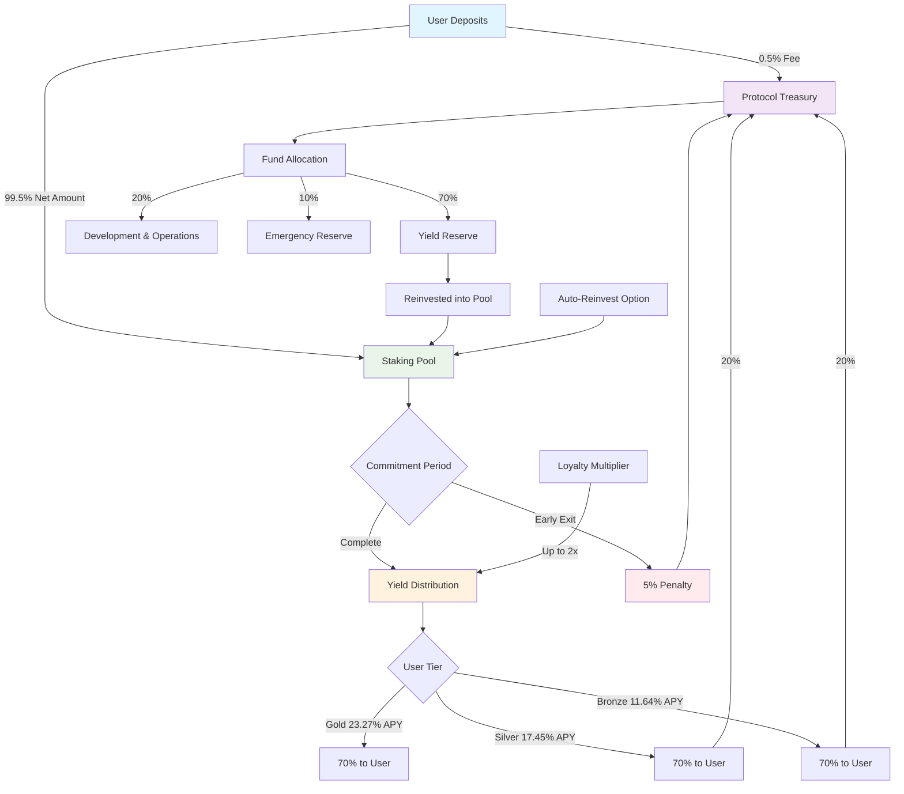
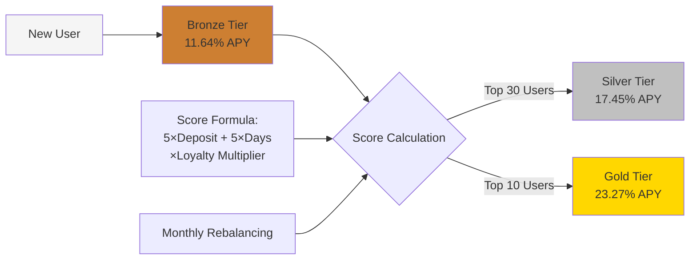
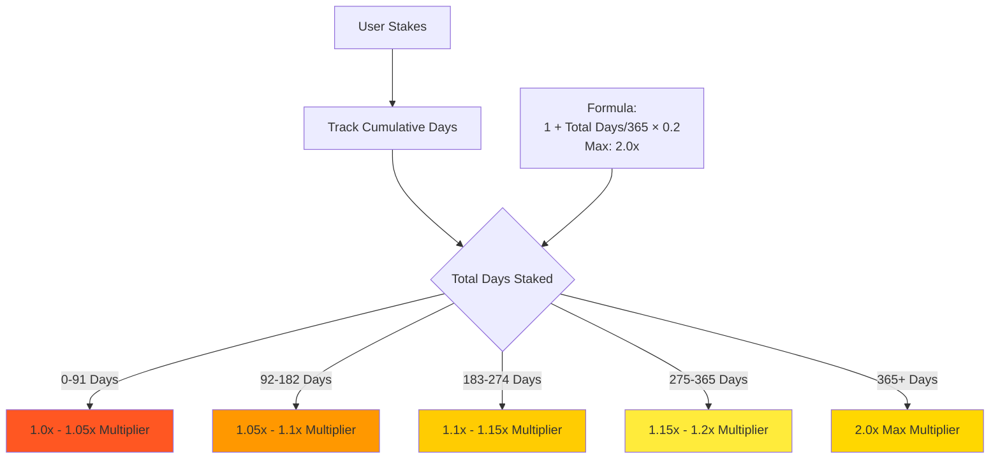
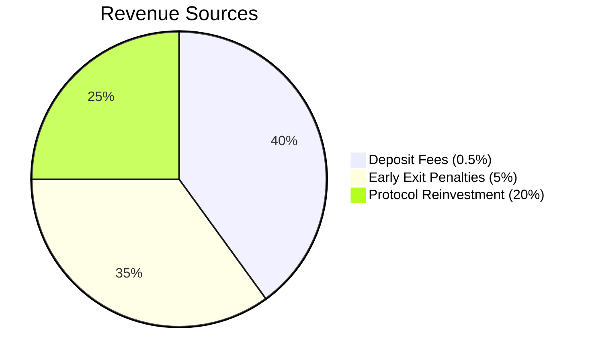
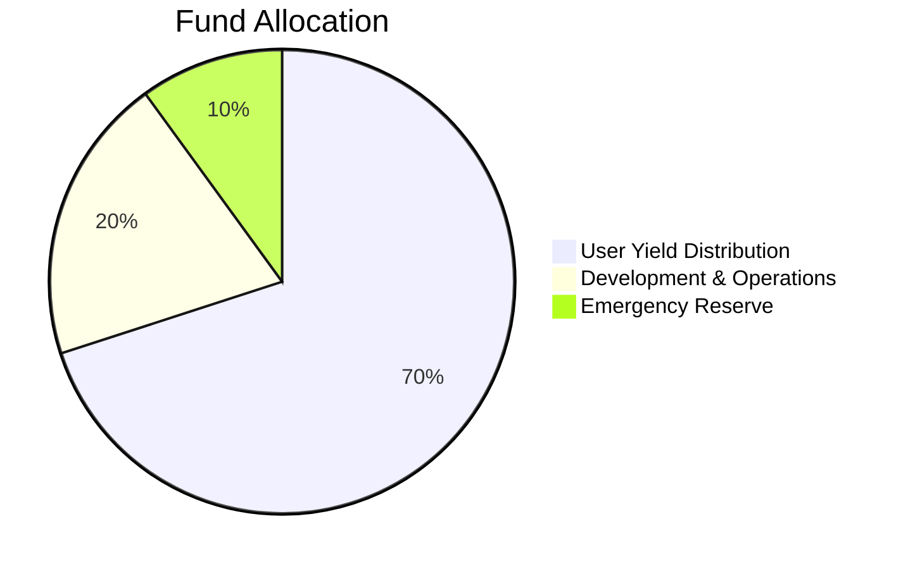
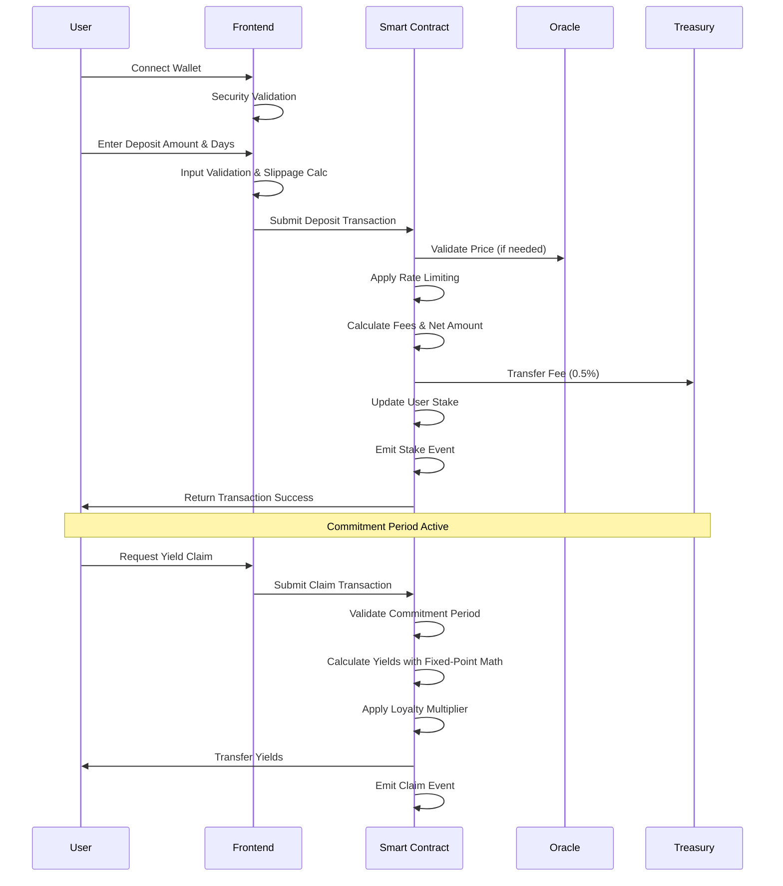
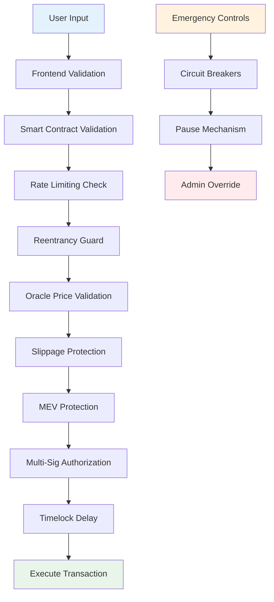
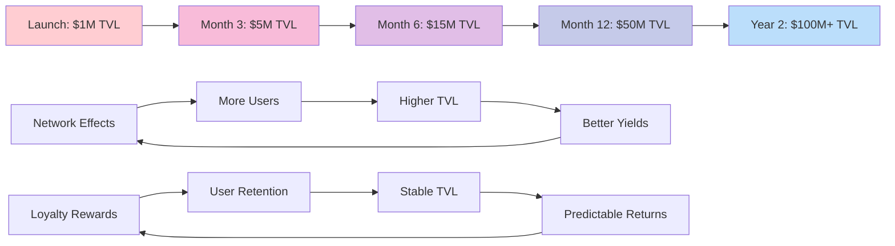
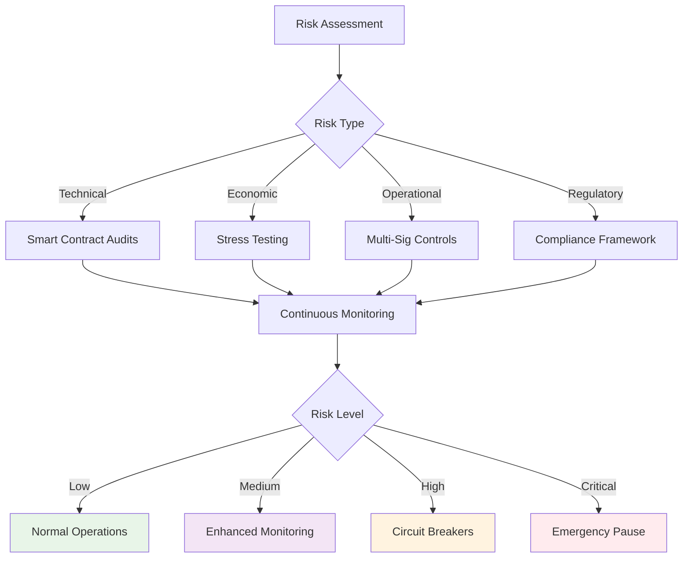

# DeFi Trust Fund - Tokenomics Flow Chart

## Fund Flow Diagram

## Tier System Flow

## Loyalty Multiplier System

## Revenue & Cost Structure

## User Journey Flow

## Security Architecture

## Growth Projection Model

## Risk Management Framework

